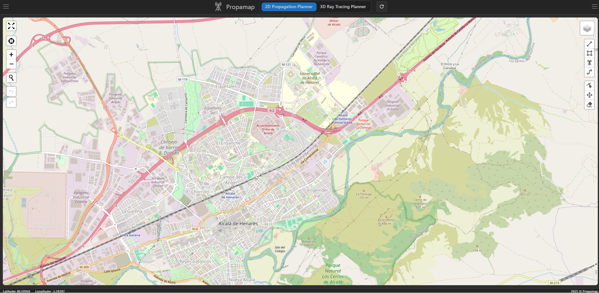

Propamap is an advanced web application designed to assist users in propagation loss analysis and antenna positioning optimization. This user manual provides a detailed guide for operating the tool, highlighting its key features and integrated modules that enable precise and detailed analyses.

## General Features

Propamap offers an intuitive, map-based interface that allows users to navigate and select specific areas anywhere in the world. The tool is tailored to address communication challenges and similar applications, providing support for real-world scenarios with exceptional precision and detail.

*Figure 1: Propamap main interface.*

### Main Modules

Propamap includes two main modules for propagation analysis and antenna positioning:

#### **2D Propagation Planner**

This module focuses on 2D analysis and features the following submodules:

- **Coverage Planning Tool:** Enables propagation loss analysis and coverage planning by positioning antennas in specific areas.
- **Terrain Elevation Analyzer:** Analyzes terrain elevations, providing critical insights to optimize antenna placement.

#### **3D Ray Tracing Planner**

This advanced module leverages ray tracing techniques to simulate radio frequency propagation in three-dimensional environments. It is a powerful tool for:

- Conducting detailed propagation loss analyses in complex scenarios.
- Optimizing antenna positioning for communication applications.

Both modules operate in real-world scenarios, allowing users to select any area on the planet to perform detailed and precise analyses. This makes Propamap an essential tool for addressing challenges related to coverage and propagation in communication systems.

Explore the sections of this manual to learn how to use each functionality and maximize the capabilities of Propamap.

| [Previous](Home) | [Home](home)     | [Next](Registration-and-Access) |
|-------------------|:-----------------:|--------------:|
